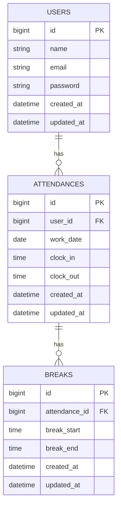

# ER図

```mermaid
erDiagram

    USERS ||--o{ ATTENDANCES : has
    ATTENDANCES ||--o{ BREAKS : has

    USERS {
        bigint id PK
        string name
        string email
        string password
        datetime created_at
        datetime updated_at
    }

    ATTENDANCES {
        bigint id PK
        bigint user_id FK
        date work_date
        time clock_in
        time clock_out
        datetime created_at
        datetime updated_at
    }

    BREAKS {
        bigint id PK
        bigint attendance_id FK
        time break_start
        time break_end
        datetime created_at
        datetime updated_at
    }
```